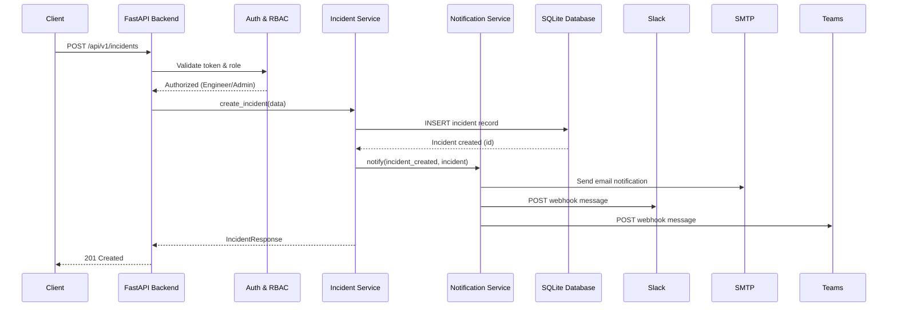
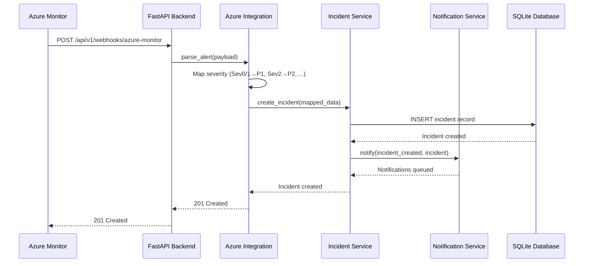

# High-Level Design (HLD)

| Field              | Value                                                      |
|--------------------|------------------------------------------------------------|
| **Title**          | Incident Management Platform — High-Level Design           |
| **Version**        | 1.0                                                        |
| **Date**           | 2026-04-02                                                 |
| **Author**         | SDLC Plan & Design Agent                                   |
| **BRD Reference**  | docs/requirements/BRD.md v1.0                              |

---

## 1. Design Overview & Goals

### 1.1 Purpose

This HLD describes the architecture of the Incident Management Platform — a web application built with Python, FastAPI, and SQLite that enables teams to create, track, assign, and resolve IT incidents. The platform integrates with Azure Monitor for automated incident ingestion, sends notifications via email, Slack, and Microsoft Teams, and provides a dashboard for operational visibility. This design targets MVP delivery as defined in the BRD.

### 1.2 Design Goals

- Keep the architecture simple and suitable for MVP delivery with a small team
- Ensure clean separation between API layer, business logic, notification services, and data access
- Provide a pluggable notification system that supports email, Slack, and Teams without tight coupling
- Design for Azure Monitor webhook integration as the primary alert ingestion mechanism
- Support role-based access control (Admin, Engineer, Viewer) across all endpoints
- Enable future migration from SQLite to PostgreSQL without major refactoring

### 1.3 Design Constraints

- Must use Python 3.11+ with FastAPI as the backend framework (BRD constraint)
- SQLite for MVP data storage (BRD constraint)
- Local authentication for MVP; Azure AD (Entra ID) as a should-have (D-004)
- Notification delivery depends on third-party service availability (Slack, Teams, SMTP)
- Azure integration limited to Azure Monitor alerts for MVP
- Must run locally for development — no cloud deployment required for MVP

---

## 2. Architecture Diagram

```
┌──────────────────────────────────────────────────────────────────┐
│                        External Services                         │
│  ┌───────────────┐  ┌──────────────┐  ┌───────────────────────┐ │
│  │ Azure Monitor  │  │ Slack API    │  │ Microsoft Teams API   │ │
│  │ (Webhooks)     │  │ (Webhooks)   │  │ (Webhooks)            │ │
│  └───────┬───────┘  └──────▲───────┘  └──────────▲────────────┘ │
│          │                 │                      │              │
│  ┌───────┼─────────────────┼──────────────────────┼───────────┐ │
│  │       │          SMTP   │                      │           │ │
│  │       │         ┌───────┴──────┐               │           │ │
│  │       │         │ Email (SMTP) │               │           │ │
│  │       │         └──────▲───────┘               │           │ │
│  └───────┼────────────────┼───────────────────────┼───────────┘ │
└──────────┼────────────────┼───────────────────────┼─────────────┘
           │                │                       │
┌──────────▼────────────────┼───────────────────────┼─────────────┐
│                     FastAPI Backend                               │
│                                                                   │
│  ┌─────────────────┐  ┌──────────────────┐  ┌────────────────┐  │
│  │  Azure Webhook   │  │  Notification    │  │  Auth & RBAC   │  │
│  │  Ingestion       │  │  Service         │  │  Service        │  │
│  │  (COMP-004)      │  │  (COMP-003)      │  │  (COMP-001)    │  │
│  └────────┬─────────┘  └────────▲─────────┘  └────────┬───────┘  │
│           │                     │                      │          │
│  ┌────────▼─────────────────────┴──────────────────────▼───────┐ │
│  │                   Incident Service (COMP-002)                │ │
│  │  (CRUD, Lifecycle, Assignment, RCA, Search, Timeline)       │ │
│  └──────────────────────────┬──────────────────────────────────┘ │
│                             │                                     │
│  ┌──────────────────────────▼──────────────────────────────────┐ │
│  │               Dashboard & Reporting (COMP-005)              │ │
│  └──────────────────────────┬──────────────────────────────────┘ │
│                             │                                     │
│  ┌──────────────────────────▼──────────────────────────────────┐ │
│  │                  Data Access Layer (COMP-006)               │ │
│  └──────────────────────────┬──────────────────────────────────┘ │
└─────────────────────────────┼────────────────────────────────────┘
                              │
                   ┌──────────▼──────────┐
                   │   SQLite Database    │
                   │   (incidents.db)     │
                   └─────────────────────┘

┌──────────────────────────────────────────────────────────────────┐
│                          Browser / Client                         │
│  ┌──────────────────────────────────────────────────────────────┐│
│  │  Jinja2 Templates (HTML/CSS/JS) — Dashboard, Incident Views ││
│  └──────────────────────────────────────────────────────────────┘│
└──────────────────────────────────────────────────────────────────┘
```

---

## 3. System Components

| Component ID | Name                          | Description                                                                                  | Technology                 | BRD Requirements                                         |
|--------------|-------------------------------|----------------------------------------------------------------------------------------------|----------------------------|----------------------------------------------------------|
| COMP-001     | Auth & RBAC Service           | Handles user authentication (local auth for MVP) and role-based access control enforcement    | FastAPI, Pydantic, JWT     | BRD-FR-009, BRD-NFR-005, BRD-NFR-006, BRD-AZ-003        |
| COMP-002     | Incident Service              | Core incident CRUD, lifecycle management, assignment, RCA, comments, search, and timeline     | FastAPI, Pydantic          | BRD-FR-001 – BRD-FR-004, BRD-FR-011, BRD-FR-012, BRD-FR-014 |
| COMP-003     | Notification Service          | Sends notifications via email (SMTP), Slack (webhooks), and Teams (webhooks) on incident events | aiosmtplib, httpx        | BRD-FR-005 – BRD-FR-007, BRD-FR-013, BRD-NC-001 – BRD-NC-006 |
| COMP-004     | Azure Integration Service     | Receives Azure Monitor alert webhooks and auto-creates incidents with severity mapping         | FastAPI, Pydantic          | BRD-FR-008, BRD-AZ-001, BRD-AZ-002, BRD-AZ-004          |
| COMP-005     | Dashboard & Reporting Service | Provides incident dashboard metrics, status overview, and CSV export                          | FastAPI, Jinja2            | BRD-FR-010, BRD-FR-015, BRD-NFR-008, BRD-NFR-009         |
| COMP-006     | Data Access Layer             | Abstracts SQLite operations, manages schema, provides repository pattern for data access      | sqlite3 (stdlib), aiosqlite| BRD-NFR-001, BRD-NFR-004, BRD-NFR-010                    |

---

## 4. Component Interactions

### 4.1 Communication Patterns

- **Client ↔ Backend**: REST API calls over HTTP. Browser renders Jinja2 templates served by FastAPI. JSON API endpoints under `/api/v1/` for programmatic access.
- **Internal modules**: Direct Python function calls between service modules. FastAPI dependency injection (`Depends()`) wires services together.
- **Backend → External Services**: Outbound HTTP/HTTPS calls to Slack API, Teams API, and SMTP relay for notifications. No polling — all event-driven.
- **Azure Monitor → Backend**: Inbound HTTP POST webhook from Azure Monitor action groups to `/api/v1/webhooks/azure-monitor`.

### 4.2 Interaction Diagram — Incident Creation



### 4.3 Interaction Diagram — Azure Monitor Alert Ingestion



---

## 5. Data Flow Overview

### 5.1 Primary Data Flows

1. **Incident Creation (Manual)**: User submits form/API → Auth validation → Incident Service creates record → Notification Service dispatches alerts → Response returned
2. **Incident Creation (Azure)**: Azure Monitor fires webhook → Webhook endpoint parses payload → Severity mapped → Incident created → Notifications dispatched
3. **Incident Lifecycle Update**: User updates status → Auth validation → Business rules enforce valid transitions → Record updated → Timeline entry logged → Notifications dispatched
4. **Dashboard View**: User requests dashboard → Auth validation → Reporting Service queries aggregated metrics → Jinja2 template rendered with data
5. **Search & Filter**: User applies filters → Auth validation → Query built with filter parameters → Results returned with pagination

### 5.2 Data Flow Diagram

```
Manual Creation:
  User Input ──▶ Auth Check ──▶ Input Validation ──▶ Incident Service ──▶ DB Write
                                                          │
                                                          ▼
                                                    Notification Service
                                                     ├──▶ Email (SMTP)
                                                     ├──▶ Slack (Webhook)
                                                     └──▶ Teams (Webhook)

Azure Alert Ingestion:
  Azure Monitor ──▶ Webhook Endpoint ──▶ Payload Parsing ──▶ Severity Mapping
                                                                    │
                                                                    ▼
                                                              Incident Service ──▶ DB Write
                                                                    │
                                                                    ▼
                                                              Notification Service

Dashboard:
  User Request ──▶ Auth Check ──▶ Reporting Service ──▶ DB Query (aggregates)
                                                              │
                                                              ▼
                                                        Jinja2 Render ──▶ User Response
```

---

## 6. Azure Monitor Integration Design

### 6.1 Integration Approach

A dedicated Azure Integration service module receives incoming webhook POST requests from Azure Monitor action groups. The service validates the payload against the Azure Monitor Common Alert Schema, extracts incident-relevant fields (alert name, severity, description, affected resource), maps Azure severity levels to platform P1–P4 priorities, and delegates to the Incident Service for creation.

### 6.2 API Usage Patterns

| Pattern                       | Description                                                                 | Endpoint / Protocol                     |
|-------------------------------|-----------------------------------------------------------------------------|------------------------------------------|
| Alert Webhook Ingestion       | Receive and parse Azure Monitor alert webhooks                              | POST /api/v1/webhooks/azure-monitor      |
| Severity Mapping              | Map Azure Monitor Sev0–Sev4 to platform P1–P4                              | Internal mapping table                   |
| Resource Metadata Extraction  | Extract Azure resource ID, resource group, subscription from alert payload  | Parsed from webhook JSON payload         |

### 6.3 Alert Severity Mapping

| Azure Monitor Severity | Platform Priority | Description       |
|------------------------|-------------------|-------------------|
| Sev0                   | P1                | Critical          |
| Sev1                   | P1                | Critical          |
| Sev2                   | P2                | High              |
| Sev3                   | P3                | Medium            |
| Sev4                   | P4                | Low               |

As defined in BRD-AZ-002.

### 6.4 Error Handling & Resilience

- **Invalid Payload**: Return 422 Unprocessable Entity with descriptive error; log malformed payloads at WARNING level
- **Duplicate Alerts**: Check for recent incidents with matching Azure alert ID; skip creation if duplicate detected within configurable window
- **Burst Handling**: Accept all incoming webhooks; incidents created synchronously. Alert deduplication and throttling prevent database flooding (R-004 mitigation)
- **Service Degradation**: If notification services are down, incident creation still succeeds; notifications are logged as failed and can be retried (BRD-NFR-011)

---

## 7. Technology Stack

| Layer            | Technology              | Version / Notes                        | Rationale                                                              |
|------------------|-------------------------|----------------------------------------|------------------------------------------------------------------------|
| Language         | Python                  | 3.11+                                  | BRD constraint; strong async ecosystem, team familiarity               |
| Web Framework    | FastAPI                 | 0.115+                                 | BRD constraint; async-native, auto OpenAPI docs, Pydantic integration  |
| Data Models      | Pydantic                | v2                                     | Request/response validation, serialization, settings management        |
| Data Storage     | SQLite                  | 3.x (stdlib)                           | BRD constraint for MVP; zero-config, file-based, sufficient for MVP scale |
| Async DB Access  | aiosqlite               | 0.20+                                  | Non-blocking SQLite access for async FastAPI endpoints                 |
| Frontend         | Jinja2 + HTML/CSS/JS    | Jinja2 3.x                             | Server-side rendering; no frontend framework overhead for MVP          |
| Auth Tokens      | PyJWT                   | 2.x                                    | Lightweight JWT for local auth; standard, well-audited library         |
| Password Hashing | passlib[bcrypt]         | 1.7+                                   | Secure password hashing with bcrypt                                    |
| HTTP Client      | httpx                   | 0.27+                                  | Async HTTP client for Slack/Teams webhook calls                        |
| Email            | aiosmtplib              | 3.x                                    | Async SMTP client for email notifications                              |
| Testing          | pytest + httpx          | pytest 8.x                             | Async test support, FastAPI test client integration                    |
| Package Manager  | pip                     | Latest                                 | Standard Python package management                                     |
| Server           | uvicorn                 | 0.30+                                  | ASGI server for FastAPI                                                |

---

## 8. Deployment Architecture

### 8.1 MVP / Local Development

The platform runs as a single FastAPI process on a developer machine. SQLite database is a local file. Outbound HTTPS connections are made to Slack, Teams, and SMTP services. No containerization or cloud hosting is required for MVP.

```
Developer Machine
├── Python 3.11+ virtual environment
├── FastAPI server (uvicorn on port 8000)
├── SQLite database file (incidents.db)
├── Environment variables (.env file)
│   ├── SECRET_KEY (JWT signing)
│   ├── SMTP_HOST, SMTP_PORT, SMTP_USER, SMTP_PASSWORD
│   ├── SLACK_WEBHOOK_URL
│   ├── TEAMS_WEBHOOK_URL
│   └── AZURE_WEBHOOK_SECRET (optional, for webhook validation)
└── Outbound HTTPS
    ├── ──▶ Slack API (webhooks)
    ├── ──▶ Microsoft Teams API (webhooks)
    └── ──▶ SMTP relay (email)
```

**To run locally:**

```bash
# 1. Create and activate virtual environment
python -m venv venv
source venv/bin/activate  # or venv\Scripts\activate on Windows

# 2. Install dependencies
pip install -r requirements.txt

# 3. Configure environment variables
cp .env.example .env
# Edit .env with your configuration

# 4. Initialize database
python -m src.database.init_db

# 5. Start server
uvicorn src.main:app --reload --port 8000
```

### 8.2 Future Deployment Considerations

- **Containerization**: Dockerfile for consistent deployment across environments
- **Database Migration**: PostgreSQL via SQLAlchemy or asyncpg for production scalability
- **Reverse Proxy**: nginx or cloud load balancer in front of uvicorn
- **Cloud Hosting**: Azure App Service or Azure Container Apps for Azure-native deployment
- **CI/CD**: GitHub Actions for automated testing, building, and deployment
- **Secrets Management**: Azure Key Vault for production secret storage

---

## 9. Security Considerations

| Area                      | Approach                                                                                          |
|---------------------------|---------------------------------------------------------------------------------------------------|
| Authentication            | Local auth with username/password for MVP; JWT tokens for session management; Azure AD as future enhancement (BRD-AZ-003) |
| Authorization (RBAC)      | Three roles: Admin, Engineer, Viewer. Enforced via FastAPI dependency injection on every endpoint (BRD-FR-009) |
| API Key Management        | All secrets (JWT key, SMTP credentials, webhook URLs) stored in environment variables only; never hardcoded or logged (BRD-NFR-006) |
| Input Validation          | All request payloads validated via Pydantic models; reject malformed input with 422 status (BRD-NFR-007) |
| XSS Prevention            | All user-generated content (incident descriptions, comments, RCA) HTML-escaped before rendering in Jinja2 templates (BRD-NFR-007) |
| CORS                      | Scoped to allowed origins only; restrictive default policy                                        |
| Webhook Security          | Azure Monitor webhook endpoint validates payload structure; optional shared secret for authentication |
| Dependency Security       | Regular `pip audit` checks; minimal dependency footprint; pin versions in requirements.txt        |
| Audit Logging             | All authentication events, incident mutations, and notification attempts logged with timestamps (BRD-NFR-012) |
| SQL Injection Prevention  | Parameterized queries only; no string concatenation in SQL statements                             |

---

## 10. Design Decisions & Trade-offs

| Decision ID | Decision                                       | Options Considered                                                  | Chosen Option              | Rationale                                                                                    |
|-------------|------------------------------------------------|---------------------------------------------------------------------|----------------------------|----------------------------------------------------------------------------------------------|
| DD-001      | Local auth for MVP                             | A) Local auth with JWT, B) Azure AD only, C) Both                  | A) Local auth with JWT     | Simplest for MVP; no external IdP dependency; Azure AD planned for future (D-004)            |
| DD-002      | SQLite with WAL mode                           | A) SQLite, B) PostgreSQL, C) In-memory store                       | A) SQLite with WAL         | BRD constraint; WAL mode handles concurrent reads; migration path to PostgreSQL planned (R-005) |
| DD-003      | Synchronous notification dispatch              | A) Sync dispatch, B) Background task queue (Celery), C) Fire-and-forget async | A) Sync within request + async HTTP | Simple for MVP; FastAPI background tasks for non-blocking dispatch without Celery overhead   |
| DD-004      | Jinja2 server-side rendering                   | A) Jinja2 SSR, B) React SPA, C) HTMX                              | A) Jinja2 SSR              | Minimal frontend complexity for MVP; no build step; matches BRD constraint                   |
| DD-005      | Repository pattern for data access             | A) Repository pattern, B) ORM (SQLAlchemy), C) Raw SQL in services | A) Repository pattern      | Clean separation; easy to swap SQLite for PostgreSQL later; testable with mocks              |
| DD-006      | Webhook-based notifications (Slack/Teams)      | A) Incoming Webhooks, B) Bot APIs, C) Graph API                    | A) Incoming Webhooks       | Simplest setup; no bot registration needed; sufficient for MVP notification needs             |
| DD-007      | Common Alert Schema for Azure Monitor          | A) Common Alert Schema, B) Custom schema parser                    | A) Common Alert Schema     | Standard Azure format; well-documented; forward-compatible with future alert types             |

---

## 11. Traceability Matrix

| HLD Component   | BRD Functional Reqs                                 | BRD Non-Functional Reqs              | BRD Azure / Notification Reqs              |
|------------------|-----------------------------------------------------|--------------------------------------|---------------------------------------------|
| COMP-001 (Auth)  | BRD-FR-009                                          | BRD-NFR-005, BRD-NFR-006, BRD-NFR-012 | BRD-AZ-003                                 |
| COMP-002 (Incident) | BRD-FR-001, BRD-FR-002, BRD-FR-003, BRD-FR-004, BRD-FR-011, BRD-FR-012, BRD-FR-014 | BRD-NFR-001, BRD-NFR-007, BRD-NFR-008, BRD-NFR-010 | —                         |
| COMP-003 (Notification) | BRD-FR-005, BRD-FR-006, BRD-FR-007, BRD-FR-013 | BRD-NFR-002, BRD-NFR-011            | BRD-NC-001 – BRD-NC-006                    |
| COMP-004 (Azure) | BRD-FR-008                                          | BRD-NFR-001                          | BRD-AZ-001, BRD-AZ-002, BRD-AZ-004         |
| COMP-005 (Dashboard) | BRD-FR-010, BRD-FR-015                          | BRD-NFR-008, BRD-NFR-009            | —                                           |
| COMP-006 (Data Access) | —                                               | BRD-NFR-001, BRD-NFR-004, BRD-NFR-010 | —                                         |
