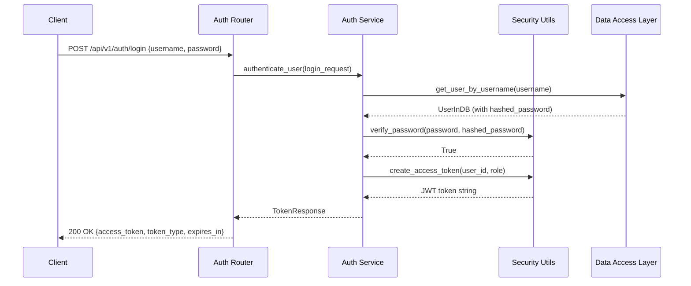
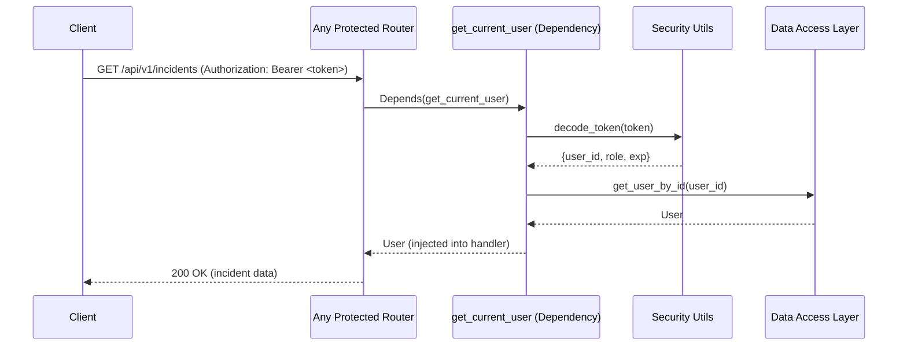
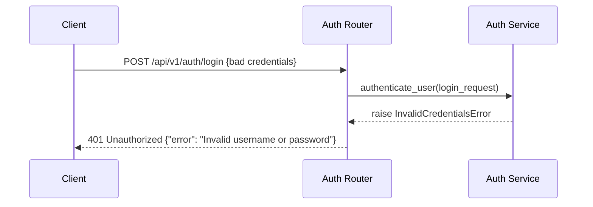

# Low-Level Design (LLD) — Auth & RBAC Service

| Field                    | Value                                              |
|--------------------------|----------------------------------------------------|
| **Title**                | Auth & RBAC Service — Low-Level Design             |
| **Component**            | Auth & RBAC Service                                |
| **Version**              | 1.0                                                |
| **Date**                 | 2026-04-02                                         |
| **Author**               | SDLC Plan & Design Agent                           |
| **HLD Component Ref**    | COMP-001                                           |

---

## 1. Component Purpose & Scope

### 1.1 Purpose

The Auth & RBAC Service handles user registration, authentication, and role-based access control for the Incident Management Platform. It provides JWT-based session management for the MVP using local username/password authentication, enforces role-based permissions (Admin, Engineer, Viewer) on all API endpoints, and logs authentication events for audit compliance. This component satisfies BRD-FR-009, BRD-NFR-005, BRD-NFR-006, and BRD-NFR-012.

### 1.2 Scope

- **Responsible for**: User registration, login/logout, JWT token issuance and validation, role enforcement on endpoints, password hashing, auth event logging
- **Not responsible for**: Azure AD / Entra ID integration (future phase), user profile management beyond auth fields, notification delivery
- **Interfaces with**: All other components via FastAPI dependency injection for auth enforcement; Data Access Layer (COMP-006) for user persistence

---

## 2. Detailed Design

### 2.1 Module / Class Structure

```
src/
└── auth/
    ├── __init__.py
    ├── router.py          # FastAPI route definitions for auth endpoints
    ├── service.py         # Authentication business logic (login, register, token management)
    ├── models.py          # Pydantic models for auth requests/responses
    ├── dependencies.py    # FastAPI Depends() for auth injection (get_current_user, require_role)
    ├── security.py        # JWT creation/validation, password hashing utilities
    └── exceptions.py      # Custom auth exceptions (InvalidCredentials, InsufficientPermissions)
```

### 2.2 Key Classes & Functions

| Class / Function           | File              | Description                                         | Inputs                              | Outputs                  |
|----------------------------|-------------------|-----------------------------------------------------|-------------------------------------|--------------------------|
| `register_user()`         | service.py        | Creates a new user with hashed password              | `UserRegisterRequest`               | `UserResponse`           |
| `authenticate_user()`     | service.py        | Validates credentials, returns JWT token             | `LoginRequest`                      | `TokenResponse`          |
| `get_current_user()`      | dependencies.py   | FastAPI dependency; extracts and validates JWT from request | `Authorization` header         | `User` model             |
| `require_role()`          | dependencies.py   | Factory dependency; checks user has required role    | `role: UserRole`                    | `User` model or 403      |
| `create_access_token()`   | security.py       | Creates a signed JWT with user claims                | `user_id, role, expires_delta`      | `str` (JWT token)        |
| `verify_password()`       | security.py       | Compares plaintext password against bcrypt hash      | `plain_password, hashed_password`   | `bool`                   |
| `hash_password()`         | security.py       | Hashes a plaintext password with bcrypt              | `plain_password`                    | `str` (hashed)           |
| `decode_token()`          | security.py       | Decodes and validates a JWT token                    | `token: str`                        | `dict` (claims) or raise |

### 2.3 Design Patterns Used

- **Dependency Injection**: `Depends(get_current_user)` and `Depends(require_role(UserRole.ADMIN))` injected into route handlers for declarative auth
- **Factory Pattern**: `require_role()` returns a dependency function parameterized by role
- **Repository Pattern**: User data access abstracted through repository functions in the Data Access Layer

---

## 3. Data Models

### 3.1 Pydantic Models

```python
from pydantic import BaseModel, EmailStr
from typing import Optional
from datetime import datetime
from enum import Enum


class UserRole(str, Enum):
    """User roles for RBAC (BRD-FR-009)."""
    ADMIN = "admin"
    ENGINEER = "engineer"
    VIEWER = "viewer"


class UserRegisterRequest(BaseModel):
    """Request schema for user registration."""
    username: str
    email: EmailStr
    password: str
    role: UserRole = UserRole.VIEWER


class LoginRequest(BaseModel):
    """Request schema for user login."""
    username: str
    password: str


class TokenResponse(BaseModel):
    """Response schema containing JWT access token."""
    access_token: str
    token_type: str = "bearer"
    expires_in: int  # seconds


class UserResponse(BaseModel):
    """Response schema for user data (no password)."""
    id: int
    username: str
    email: str
    role: UserRole
    created_at: datetime


class UserInDB(BaseModel):
    """Internal user model including hashed password."""
    id: int
    username: str
    email: str
    role: UserRole
    hashed_password: str
    created_at: datetime
    is_active: bool = True
```

### 3.2 Database Schema

```sql
CREATE TABLE users (
    id INTEGER PRIMARY KEY AUTOINCREMENT,
    username TEXT UNIQUE NOT NULL,
    email TEXT UNIQUE NOT NULL,
    hashed_password TEXT NOT NULL,
    role TEXT NOT NULL DEFAULT 'viewer' CHECK(role IN ('admin', 'engineer', 'viewer')),
    is_active BOOLEAN NOT NULL DEFAULT 1,
    created_at TIMESTAMP DEFAULT CURRENT_TIMESTAMP,
    updated_at TIMESTAMP DEFAULT CURRENT_TIMESTAMP
);

CREATE INDEX idx_users_username ON users(username);
CREATE INDEX idx_users_email ON users(email);
```

---

## 4. API Specifications

### 4.1 Endpoints

| Method | Path                        | Description                          | Request Body            | Response Body      | Status Codes       | Auth Required |
|--------|---------------------------- |--------------------------------------|-------------------------|--------------------|--------------------|---------------|
| POST   | /api/v1/auth/register       | Register a new user                  | `UserRegisterRequest`   | `UserResponse`     | 201, 400, 409, 422 | No (MVP)      |
| POST   | /api/v1/auth/login          | Authenticate and receive JWT token   | `LoginRequest`          | `TokenResponse`    | 200, 401, 422      | No            |
| GET    | /api/v1/auth/me             | Get current authenticated user info  | —                       | `UserResponse`     | 200, 401           | Yes           |
| GET    | /api/v1/users               | List all users (Admin only)          | —                       | `List[UserResponse]` | 200, 401, 403   | Yes (Admin)   |
| PUT    | /api/v1/users/{user_id}/role | Update user role (Admin only)       | `{role: UserRole}`      | `UserResponse`     | 200, 401, 403, 404 | Yes (Admin)   |

### 4.2 Request / Response Examples

```json
// POST /api/v1/auth/register
{
    "username": "john.doe",
    "email": "john.doe@example.com",
    "password": "SecureP@ss123",
    "role": "engineer"
}
```

```json
// 201 Created
{
    "id": 1,
    "username": "john.doe",
    "email": "john.doe@example.com",
    "role": "engineer",
    "created_at": "2026-04-02T10:00:00Z"
}
```

```json
// POST /api/v1/auth/login
{
    "username": "john.doe",
    "password": "SecureP@ss123"
}
```

```json
// 200 OK
{
    "access_token": "eyJhbGciOiJIUzI1NiIsInR5cCI6IkpXVCJ9...",
    "token_type": "bearer",
    "expires_in": 3600
}
```

---

## 5. Sequence Diagrams

### 5.1 Login Flow



### 5.2 Auth Dependency Flow (Protected Endpoint)



### 5.3 Error Flow — Invalid Credentials



---

## 6. Error Handling Strategy

### 6.1 Exception Hierarchy

| Exception Class               | HTTP Status | Description                                      | Retry? |
|-------------------------------|-------------|--------------------------------------------------|--------|
| `InvalidCredentialsError`     | 401         | Username or password is incorrect                | No     |
| `TokenExpiredError`           | 401         | JWT token has expired                            | No (re-login) |
| `InvalidTokenError`           | 401         | JWT token is malformed or tampered with          | No     |
| `InsufficientPermissionsError`| 403         | User role does not have access to this resource  | No     |
| `UserNotFoundError`           | 404         | Referenced user does not exist                   | No     |
| `UserAlreadyExistsError`      | 409         | Username or email already registered             | No     |

### 6.2 Error Response Format

```json
{
    "error": {
        "code": "INVALID_CREDENTIALS",
        "message": "Invalid username or password",
        "details": null
    }
}
```

### 6.3 Logging

- **INFO**: Successful login, user registration, role changes
- **WARNING**: Failed login attempts (username logged, never password), expired token usage
- **ERROR**: Token validation failures, database errors during auth
- **Context**: Request ID, username (for login attempts), user ID (for authenticated requests), IP address

---

## 7. Configuration & Environment Variables

| Variable          | Description                                    | Required | Default              |
|-------------------|------------------------------------------------|----------|----------------------|
| `SECRET_KEY`      | JWT signing secret key                         | Yes      | —                    |
| `TOKEN_EXPIRY`    | JWT token expiration time in seconds           | No       | 3600 (1 hour)        |
| `BCRYPT_ROUNDS`   | Number of bcrypt hashing rounds                | No       | 12                   |

---

## 8. Dependencies

### 8.1 Internal Dependencies

| Component          | Purpose                                       | Interface                          |
|--------------------|-----------------------------------------------|------------------------------------|
| COMP-006 (Data Access) | Store and retrieve user records            | `get_user_by_username()`, `create_user()`, `get_user_by_id()` |

### 8.2 External Dependencies

| Package / Service       | Version     | Purpose                                  |
|-------------------------|-------------|------------------------------------------|
| PyJWT                   | 2.x         | JWT token creation and validation        |
| passlib[bcrypt]         | 1.7+        | Secure password hashing with bcrypt      |
| pydantic[email]         | 2.x         | Email validation for user registration   |

---

## 9. Traceability

| LLD Element                      | HLD Component  | BRD Requirement(s)                     |
|----------------------------------|----------------|----------------------------------------|
| POST /api/v1/auth/register       | COMP-001       | BRD-FR-009                             |
| POST /api/v1/auth/login          | COMP-001       | BRD-FR-009, BRD-NFR-005               |
| get_current_user dependency      | COMP-001       | BRD-FR-009, BRD-NFR-005               |
| require_role dependency          | COMP-001       | BRD-FR-009, BRD-NFR-005               |
| Password hashing (bcrypt)        | COMP-001       | BRD-NFR-006                            |
| Auth event logging               | COMP-001       | BRD-NFR-012                            |
| users table                      | COMP-001       | BRD-FR-009                             |
