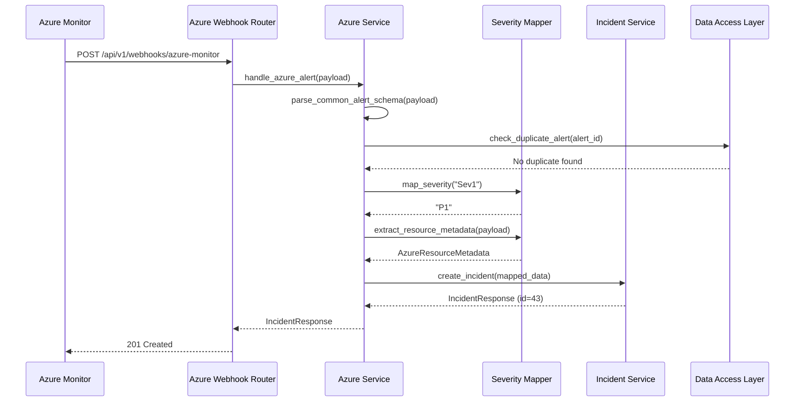
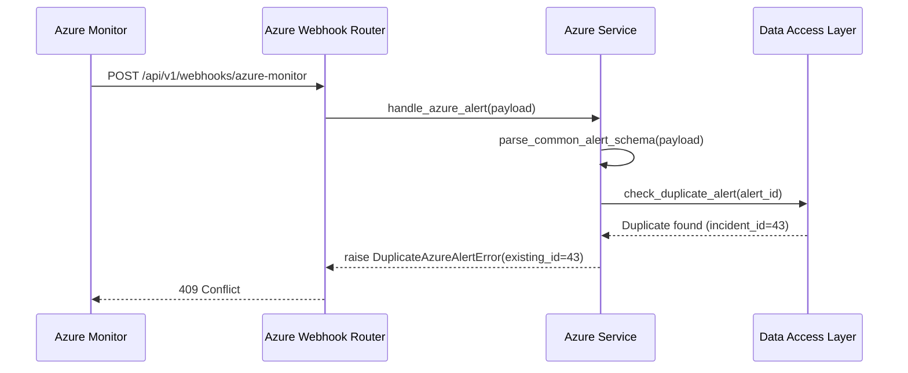

# Low-Level Design (LLD) — Azure Integration Service

| Field                    | Value                                              |
|--------------------------|----------------------------------------------------|
| **Title**                | Azure Integration Service — Low-Level Design       |
| **Component**            | Azure Integration Service                          |
| **Version**              | 1.0                                                |
| **Date**                 | 2026-04-02                                         |
| **Author**               | SDLC Plan & Design Agent                           |
| **HLD Component Ref**    | COMP-004                                           |

---

## 1. Component Purpose & Scope

### 1.1 Purpose

The Azure Integration Service receives incoming Azure Monitor alert webhooks, validates and parses the payload against the Common Alert Schema, maps Azure severity levels to platform P1–P4 priorities, extracts Azure resource metadata, and delegates incident creation to the Incident Service. This component satisfies BRD-FR-008, BRD-AZ-001, BRD-AZ-002, and BRD-AZ-004.

### 1.2 Scope

- **Responsible for**: Webhook endpoint for Azure Monitor alerts, payload validation and parsing, severity mapping, resource metadata extraction, deduplication of alerts, delegating to Incident Service
- **Not responsible for**: Incident lifecycle management (COMP-002), notification dispatch (COMP-003), user authentication for webhook endpoint (uses optional shared secret)
- **Interfaces with**: Incident Service (COMP-002) for incident creation, Data Access Layer (COMP-006) for deduplication checks

---

## 2. Detailed Design

### 2.1 Module / Class Structure

```
src/
└── azure_integration/
    ├── __init__.py
    ├── router.py          # FastAPI route for Azure Monitor webhook endpoint
    ├── service.py         # Alert parsing, severity mapping, deduplication logic
    ├── models.py          # Pydantic models for Azure Monitor alert schema
    ├── mapper.py          # Severity and metadata mapping functions
    └── exceptions.py      # Custom exceptions for Azure integration
```

### 2.2 Key Classes & Functions

| Class / Function                 | File         | Description                                               | Inputs                         | Outputs                  |
|----------------------------------|-------------|-----------------------------------------------------------|--------------------------------|--------------------------|
| `handle_azure_alert()`          | service.py   | Main handler: validates, parses, maps, and creates incident | `AzureAlertPayload`           | `IncidentResponse`       |
| `parse_common_alert_schema()`   | service.py   | Parses Azure Monitor Common Alert Schema payload           | `dict` (raw JSON)             | `AzureAlertPayload`      |
| `map_severity()`                | mapper.py    | Maps Azure Monitor severity to platform P1–P4              | `azure_severity: str`         | `IncidentSeverity`       |
| `extract_resource_metadata()`   | mapper.py    | Extracts Azure resource ID, group, subscription            | `AzureAlertPayload`           | `AzureResourceMetadata`  |
| `check_duplicate_alert()`       | service.py   | Checks if an alert with same ID was recently ingested      | `alert_id: str`               | `bool`                   |
| `validate_webhook_secret()`     | service.py   | Optional: validates shared secret from webhook header      | `request: Request`            | `bool` or raise          |

### 2.3 Design Patterns Used

- **Adapter Pattern**: Translates Azure Monitor alert schema to the platform's internal incident model
- **Guard Clause**: Deduplication check early in the pipeline to avoid creating duplicate incidents
- **Mapper Module**: Isolated mapping functions for testability and maintainability

---

## 3. Data Models

### 3.1 Pydantic Models

```python
from pydantic import BaseModel
from typing import Optional
from datetime import datetime


class AzureAlertContext(BaseModel):
    """Azure Monitor alert context from Common Alert Schema."""
    condition_type: Optional[str] = None
    condition: Optional[dict] = None


class AzureAlertResource(BaseModel):
    """Azure resource details from alert payload (BRD-AZ-004)."""
    resource_id: Optional[str] = None
    resource_group: Optional[str] = None
    subscription_id: Optional[str] = None
    resource_type: Optional[str] = None
    resource_name: Optional[str] = None


class AzureAlertEssentials(BaseModel):
    """Essentials section of Azure Monitor Common Alert Schema."""
    alert_id: str
    alert_rule: str
    severity: str  # Sev0–Sev4
    signal_type: Optional[str] = None
    monitor_condition: Optional[str] = None
    monitoring_service: Optional[str] = None
    fired_date_time: Optional[datetime] = None
    resolved_date_time: Optional[datetime] = None
    description: Optional[str] = None
    essentials_version: Optional[str] = None
    alert_targets_ids: Optional[list] = None
    alert_context_version: Optional[str] = None


class AzureAlertPayload(BaseModel):
    """Top-level Azure Monitor Common Alert Schema payload (BRD-AZ-001)."""
    schema_id: str
    data: dict  # Contains 'essentials' and 'alertContext'


class AzureResourceMetadata(BaseModel):
    """Extracted Azure resource metadata for incident."""
    resource_id: Optional[str] = None
    resource_group: Optional[str] = None
    subscription_id: Optional[str] = None
```

### 3.2 Severity Mapping Table

```python
# BRD-AZ-002: Azure Monitor severity to platform priority mapping
SEVERITY_MAP = {
    "Sev0": "P1",  # Critical
    "Sev1": "P1",  # Critical
    "Sev2": "P2",  # High
    "Sev3": "P3",  # Medium
    "Sev4": "P4",  # Low
}
```

---

## 4. API Specifications

### 4.1 Endpoints

| Method | Path                                    | Description                                | Request Body              | Response Body         | Status Codes             | Auth               |
|--------|----------------------------------------|--------------------------------------------|---------------------------|-----------------------|--------------------------|--------------------|
| POST   | /api/v1/webhooks/azure-monitor         | Receive Azure Monitor alert webhook        | `AzureAlertPayload`      | `IncidentResponse`    | 201, 400, 409, 422       | Webhook secret (optional) |

### 4.2 Request / Response Examples

```json
// POST /api/v1/webhooks/azure-monitor
// Azure Monitor Common Alert Schema payload
{
    "schemaId": "azureMonitorCommonAlertSchema",
    "data": {
        "essentials": {
            "alertId": "/subscriptions/abc-123/providers/Microsoft.AlertsManagement/alerts/alert-456",
            "alertRule": "High CPU Alert",
            "severity": "Sev1",
            "signalType": "Metric",
            "monitorCondition": "Fired",
            "monitoringService": "Platform",
            "firedDateTime": "2026-04-02T10:15:00.000Z",
            "description": "CPU usage exceeded 90% on production-vm-01"
        },
        "alertContext": {
            "conditionType": "SingleResourceMultipleMetricCriteria",
            "condition": {
                "allOf": [
                    {
                        "metricName": "Percentage CPU",
                        "metricValue": 95.2,
                        "operator": "GreaterThan",
                        "threshold": 90,
                        "timeAggregation": "Average"
                    }
                ]
            }
        },
        "customProperties": {}
    }
}
```

```json
// 201 Created
{
    "id": 43,
    "title": "[Azure Alert] High CPU Alert",
    "description": "CPU usage exceeded 90% on production-vm-01",
    "severity": "P1",
    "status": "open",
    "category": "azure-monitor",
    "created_by": 0,
    "assignee_id": null,
    "azure_alert_id": "/subscriptions/abc-123/providers/Microsoft.AlertsManagement/alerts/alert-456",
    "azure_resource_id": null,
    "created_at": "2026-04-02T10:15:30Z",
    "updated_at": "2026-04-02T10:15:30Z"
}
```

```json
// 409 Conflict (duplicate alert)
{
    "error": {
        "code": "DUPLICATE_AZURE_ALERT",
        "message": "Alert with ID '/subscriptions/abc-123/providers/.../alert-456' was already ingested",
        "details": {"existing_incident_id": 43}
    }
}
```

---

## 5. Sequence Diagrams

### 5.1 Azure Alert Ingestion Flow



### 5.2 Duplicate Alert Flow



---

## 6. Error Handling Strategy

### 6.1 Exception Hierarchy

| Exception Class                | HTTP Status | Description                                        | Retry? |
|--------------------------------|-------------|----------------------------------------------------|--------|
| `InvalidAlertPayloadError`     | 422         | Payload does not match Common Alert Schema         | No     |
| `DuplicateAzureAlertError`     | 409         | Alert with same ID already ingested                | No     |
| `UnknownSeverityError`         | 422         | Alert severity is not in recognized mapping        | No     |
| `WebhookSecretMismatchError`   | 401         | Shared secret in header does not match configured  | No     |

### 6.2 Error Response Format

```json
{
    "error": {
        "code": "INVALID_ALERT_PAYLOAD",
        "message": "Azure Monitor alert payload is missing required field: data.essentials.severity",
        "details": {"missing_field": "data.essentials.severity"}
    }
}
```

### 6.3 Logging

- **INFO**: Alert received and incident created (alert_id, mapped severity, incident_id)
- **WARNING**: Duplicate alert rejected (alert_id), unknown severity mapped to default
- **ERROR**: Payload parsing failure (alert_id if available, error details)
- **Context**: Alert ID, Azure resource ID, mapped severity, created incident ID

---

## 7. Configuration & Environment Variables

| Variable                    | Description                                        | Required | Default     |
|-----------------------------|----------------------------------------------------|----------|-------------|
| `AZURE_WEBHOOK_SECRET`      | Shared secret for webhook authentication           | No       | —           |
| `AZURE_DEDUP_WINDOW_HOURS`  | Hours to check for duplicate alerts                | No       | 24          |

---

## 8. Dependencies

### 8.1 Internal Dependencies

| Component              | Purpose                                       | Interface                                |
|------------------------|-----------------------------------------------|------------------------------------------|
| COMP-002 (Incident)    | Create incidents from parsed alerts            | `create_incident(incident_data)`         |
| COMP-006 (Data Access) | Check for duplicate alerts                     | `get_incident_by_azure_alert_id()`       |

### 8.2 External Dependencies

| Package / Service       | Version     | Purpose                                  |
|-------------------------|-------------|------------------------------------------|
| pydantic                | 2.x         | Payload validation and parsing           |

---

## 9. Traceability

| LLD Element                              | HLD Component  | BRD Requirement(s)                  |
|------------------------------------------|----------------|-------------------------------------|
| POST /api/v1/webhooks/azure-monitor      | COMP-004       | BRD-FR-008, BRD-AZ-001             |
| map_severity()                           | COMP-004       | BRD-AZ-002                          |
| extract_resource_metadata()              | COMP-004       | BRD-AZ-004                          |
| parse_common_alert_schema()              | COMP-004       | BRD-AZ-001                          |
| check_duplicate_alert()                  | COMP-004       | Risk R-004 mitigation               |
