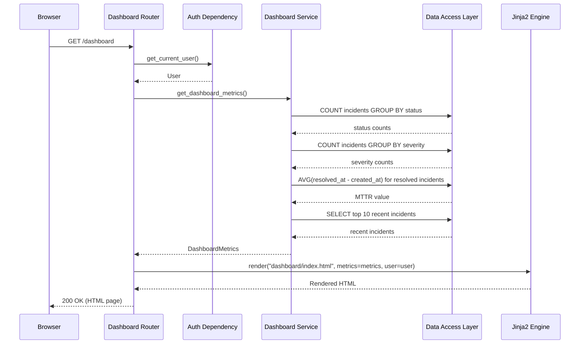
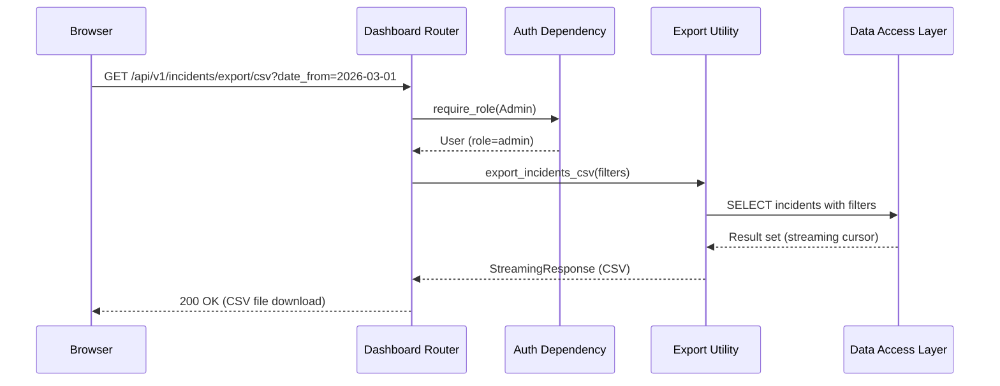

# Low-Level Design (LLD) — Dashboard & Reporting Service

| Field                    | Value                                              |
|--------------------------|----------------------------------------------------|
| **Title**                | Dashboard & Reporting Service — Low-Level Design   |
| **Component**            | Dashboard & Reporting Service                      |
| **Version**              | 1.0                                                |
| **Date**                 | 2026-04-02                                         |
| **Author**               | SDLC Plan & Design Agent                           |
| **HLD Component Ref**    | COMP-005                                           |

---

## 1. Component Purpose & Scope

### 1.1 Purpose

The Dashboard & Reporting Service provides incident summary metrics, status overview, and data export capabilities. It serves both the API (JSON metrics) and the frontend (Jinja2-rendered dashboard pages). The dashboard enables admins and engineers to monitor operational health at a glance. This component satisfies BRD-FR-010, BRD-FR-015, BRD-NFR-008, and BRD-NFR-009.

### 1.2 Scope

- **Responsible for**: Aggregated incident metrics (counts by status, severity, MTTR), dashboard page rendering, CSV export of incident data
- **Not responsible for**: Individual incident CRUD (COMP-002), notification management (COMP-003), user authentication (COMP-001)
- **Interfaces with**: Data Access Layer (COMP-006) for aggregated queries, Auth & RBAC (COMP-001) for access control, Jinja2 template engine for frontend rendering

---

## 2. Detailed Design

### 2.1 Module / Class Structure

```
src/
└── dashboard/
    ├── __init__.py
    ├── router.py          # FastAPI routes for dashboard API and page routes
    ├── service.py         # Business logic for metrics aggregation and export
    ├── models.py          # Pydantic models for dashboard data
    └── export.py          # CSV export utility functions

templates/
└── dashboard/
    ├── index.html         # Main dashboard page
    ├── _metrics_cards.html # Partial: summary metric cards
    └── _incident_table.html # Partial: recent incidents table

static/
├── css/
│   └── dashboard.css      # Dashboard-specific styles
└── js/
    └── dashboard.js       # Dashboard interactivity (filters, refresh)
```

### 2.2 Key Classes & Functions

| Class / Function                | File         | Description                                                 | Inputs                     | Outputs                    |
|---------------------------------|-------------|-------------------------------------------------------------|----------------------------|----------------------------|
| `get_dashboard_metrics()`      | service.py   | Computes aggregated incident metrics for dashboard           | `MetricsFilterParams`      | `DashboardMetrics`         |
| `get_incidents_by_status()`    | service.py   | Groups incident counts by status                             | Optional date range        | `Dict[str, int]`           |
| `get_incidents_by_severity()`  | service.py   | Groups incident counts by severity                           | Optional date range        | `Dict[str, int]`           |
| `calculate_mttr()`             | service.py   | Calculates mean time to resolution for resolved incidents    | Optional date range, severity filter | `float` (hours)   |
| `get_recent_incidents()`       | service.py   | Retrieves N most recent incidents for dashboard display      | `limit: int`               | `List[IncidentSummary]`    |
| `export_incidents_csv()`       | export.py    | Generates CSV file from filtered incident data               | `ExportFilterParams`       | `StreamingResponse` (CSV)  |
| `render_dashboard()`          | router.py    | Renders Jinja2 dashboard template with metrics data          | `Request`                  | `TemplateResponse`         |

### 2.3 Design Patterns Used

- **Aggregation Service**: Dedicated functions for computing metrics from raw incident data
- **Streaming Export**: CSV export uses `StreamingResponse` for memory-efficient large exports
- **Template Partials**: Dashboard template uses includes for reusable components

---

## 3. Data Models

### 3.1 Pydantic Models

```python
from pydantic import BaseModel
from typing import Optional, Dict, List
from datetime import datetime


class MetricsFilterParams(BaseModel):
    """Filter parameters for dashboard metrics."""
    date_from: Optional[datetime] = None
    date_to: Optional[datetime] = None


class IncidentCountBySeverity(BaseModel):
    """Incident counts grouped by severity."""
    P1: int = 0
    P2: int = 0
    P3: int = 0
    P4: int = 0


class IncidentCountByStatus(BaseModel):
    """Incident counts grouped by status."""
    open: int = 0
    acknowledged: int = 0
    investigating: int = 0
    resolved: int = 0
    closed: int = 0


class DashboardMetrics(BaseModel):
    """Aggregated metrics for the dashboard (BRD-FR-010)."""
    total_open: int
    total_incidents: int
    mttr_hours: Optional[float] = None  # Mean Time to Resolution in hours
    mtta_minutes: Optional[float] = None  # Mean Time to Acknowledge in minutes
    by_severity: IncidentCountBySeverity
    by_status: IncidentCountByStatus
    recent_incidents: List[dict]  # Simplified incident summaries


class ExportFilterParams(BaseModel):
    """Filter parameters for CSV export (BRD-FR-015)."""
    date_from: Optional[datetime] = None
    date_to: Optional[datetime] = None
    status: Optional[str] = None
    severity: Optional[str] = None


class IncidentSummary(BaseModel):
    """Lightweight incident summary for dashboard display."""
    id: int
    title: str
    severity: str
    status: str
    assignee_name: Optional[str] = None
    created_at: datetime
    updated_at: datetime
```

---

## 4. API Specifications

### 4.1 Endpoints

| Method | Path                              | Description                                  | Request Body           | Response Body           | Status Codes       | Auth / Role       |
|--------|-----------------------------------|----------------------------------------------|------------------------|-------------------------|--------------------|-------------------|
| GET    | /api/v1/dashboard/metrics         | Get aggregated incident metrics (JSON API)   | Query params (filters) | `DashboardMetrics`      | 200, 401           | Any authenticated |
| GET    | /api/v1/incidents/export/csv      | Export incidents as CSV download              | Query params (filters) | CSV file (streaming)    | 200, 401, 403      | Admin             |
| GET    | /dashboard                        | Render dashboard HTML page                   | —                      | HTML (Jinja2 template)  | 200, 302 (redirect)| Any authenticated |

### 4.2 Request / Response Examples

```json
// GET /api/v1/dashboard/metrics?date_from=2026-03-01&date_to=2026-04-01
// 200 OK
{
    "total_open": 12,
    "total_incidents": 87,
    "mttr_hours": 3.5,
    "mtta_minutes": 4.2,
    "by_severity": {
        "P1": 3,
        "P2": 8,
        "P3": 15,
        "P4": 61
    },
    "by_status": {
        "open": 5,
        "acknowledged": 3,
        "investigating": 4,
        "resolved": 25,
        "closed": 50
    },
    "recent_incidents": [
        {
            "id": 87,
            "title": "Database connection pool exhausted",
            "severity": "P1",
            "status": "investigating",
            "assignee_name": "John Doe",
            "created_at": "2026-04-02T10:30:00Z"
        }
    ]
}
```

```
// GET /api/v1/incidents/export/csv
// 200 OK
// Content-Type: text/csv
// Content-Disposition: attachment; filename="incidents_2026-04-02.csv"

id,title,severity,status,category,assignee,created_at,resolved_at,rca_root_cause
42,"Database connection pool exhausted",P1,investigating,infrastructure,john.doe,2026-04-02T10:30:00Z,,
...
```

---

## 5. Sequence Diagrams

### 5.1 Dashboard Page Load



### 5.2 CSV Export Flow



---

## 6. Error Handling Strategy

### 6.1 Exception Hierarchy

| Exception Class               | HTTP Status | Description                               | Retry? |
|-------------------------------|-------------|-------------------------------------------|--------|
| `MetricsCalculationError`     | 500         | Error computing aggregated metrics        | Yes    |
| `ExportError`                 | 500         | Error generating CSV export               | Yes    |

### 6.2 Logging

- **INFO**: Dashboard loaded (user_id, filter params), CSV export initiated (user_id, filters, row count)
- **WARNING**: Slow metrics query (> 2s)
- **ERROR**: Database query failure during metrics aggregation
- **Context**: User ID, filter parameters, query execution time

---

## 7. Configuration & Environment Variables

No component-specific environment variables. Uses global app configuration for database path and template directory.

---

## 8. Dependencies

### 8.1 Internal Dependencies

| Component              | Purpose                                       | Interface                                     |
|------------------------|-----------------------------------------------|-----------------------------------------------|
| COMP-001 (Auth)        | Access control for dashboard and export        | `get_current_user()`, `require_role(Admin)` for export |
| COMP-006 (Data Access) | Aggregated queries for metrics and export data | SQL aggregate queries, filtered selects       |

### 8.2 External Dependencies

| Package / Service       | Version     | Purpose                                  |
|-------------------------|-------------|------------------------------------------|
| Jinja2                  | 3.x         | Template rendering for dashboard pages   |
| csv (stdlib)            | —           | CSV generation for export                |

---

## 9. Traceability

| LLD Element                          | HLD Component  | BRD Requirement(s)                    |
|--------------------------------------|----------------|---------------------------------------|
| GET /api/v1/dashboard/metrics        | COMP-005       | BRD-FR-010                            |
| GET /api/v1/incidents/export/csv     | COMP-005       | BRD-FR-015                            |
| GET /dashboard (HTML page)           | COMP-005       | BRD-FR-010, BRD-NFR-008, BRD-NFR-009 |
| DashboardMetrics (MTTR, counts)      | COMP-005       | BRD-FR-010                            |
| Responsive dashboard layout          | COMP-005       | BRD-NFR-009                           |
| 2-click acknowledge from dashboard   | COMP-005       | BRD-NFR-008                           |
