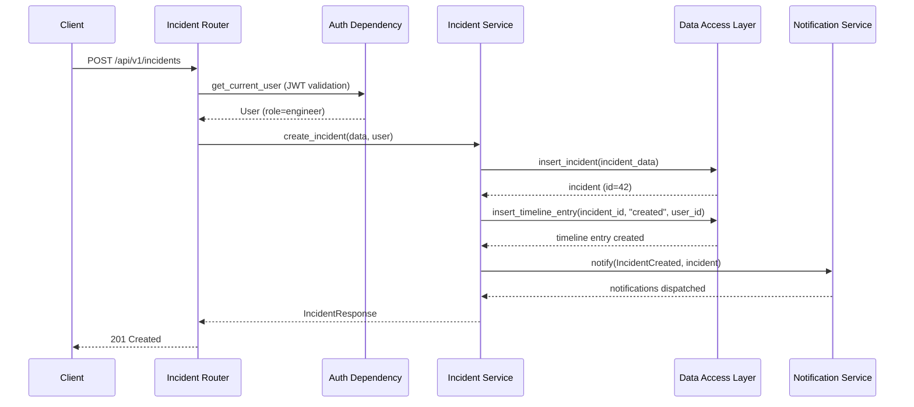
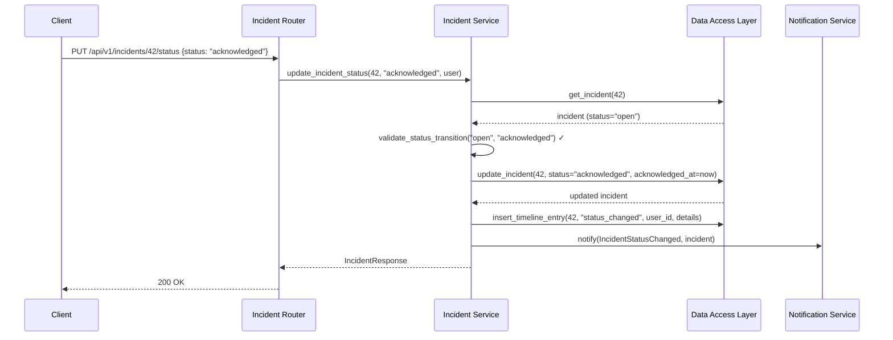
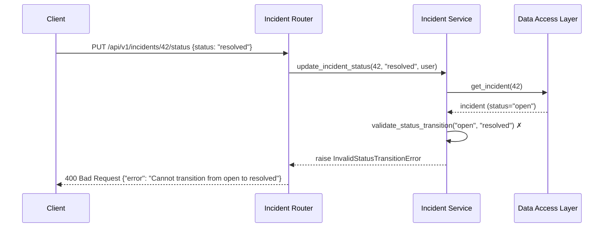

# Low-Level Design (LLD) — Incident Service

| Field                    | Value                                              |
|--------------------------|----------------------------------------------------|
| **Title**                | Incident Service — Low-Level Design                |
| **Component**            | Incident Service                                   |
| **Version**              | 1.0                                                |
| **Date**                 | 2026-04-02                                         |
| **Author**               | SDLC Plan & Design Agent                           |
| **HLD Component Ref**    | COMP-002                                           |

---

## 1. Component Purpose & Scope

### 1.1 Purpose

The Incident Service is the core business logic component of the platform. It manages the full incident lifecycle — creation, assignment, status transitions, root cause analysis, comments, search/filter, and activity timeline. It enforces business rules such as valid state transitions and RCA requirements, and triggers notifications on incident events. This component satisfies BRD-FR-001 through BRD-FR-004, BRD-FR-011, BRD-FR-012, and BRD-FR-014.

### 1.2 Scope

- **Responsible for**: Incident CRUD, lifecycle state management, assignment, RCA management, comments, search/filter, activity timeline, triggering notifications on events
- **Not responsible for**: User authentication (COMP-001), notification delivery (COMP-003), Azure alert parsing (COMP-004), dashboard aggregation (COMP-005)
- **Interfaces with**: Auth & RBAC (COMP-001) for access control, Notification Service (COMP-003) for event dispatch, Data Access Layer (COMP-006) for persistence

---

## 2. Detailed Design

### 2.1 Module / Class Structure

```
src/
└── incidents/
    ├── __init__.py
    ├── router.py          # FastAPI route definitions for incident endpoints
    ├── service.py         # Incident business logic (CRUD, lifecycle, assignment)
    ├── models.py          # Pydantic models for incident requests/responses
    ├── dependencies.py    # FastAPI dependencies specific to incidents
    └── exceptions.py      # Custom incident exceptions
```

### 2.2 Key Classes & Functions

| Class / Function                | File         | Description                                                | Inputs                              | Outputs                     |
|---------------------------------|--------------|-----------------------------------------------------------|-------------------------------------|-----------------------------|
| `create_incident()`            | service.py   | Creates a new incident and triggers notifications          | `IncidentCreateRequest`, `User`     | `IncidentResponse`          |
| `get_incident()`               | service.py   | Retrieves a single incident by ID                          | `incident_id: int`                  | `IncidentResponse`          |
| `list_incidents()`             | service.py   | Lists incidents with optional filters and pagination       | `IncidentFilterParams`              | `PaginatedResponse`         |
| `update_incident_status()`     | service.py   | Transitions incident to new lifecycle state                | `incident_id, new_status, User`     | `IncidentResponse`          |
| `assign_incident()`            | service.py   | Assigns incident to an engineer                            | `incident_id, assignee_id, User`    | `IncidentResponse`          |
| `update_rca()`                 | service.py   | Updates root cause analysis fields on an incident          | `incident_id, RCAUpdateRequest`     | `IncidentResponse`          |
| `add_comment()`                | service.py   | Adds a comment/note to an incident                         | `incident_id, CommentRequest, User` | `CommentResponse`           |
| `get_incident_timeline()`      | service.py   | Returns the activity timeline for an incident              | `incident_id: int`                  | `List[TimelineEntry]`       |
| `validate_status_transition()` | service.py   | Validates that a state transition is allowed               | `current_status, new_status`        | `bool` or raise             |

### 2.3 Design Patterns Used

- **Repository Pattern**: Data access abstracted through repository functions in COMP-006
- **Event-Driven Notifications**: Incident mutations trigger notification events dispatched to COMP-003
- **State Machine**: Incident lifecycle enforced via valid transition map
- **Dependency Injection**: FastAPI `Depends()` for auth and service wiring

---

## 3. Data Models

### 3.1 Pydantic Models

```python
from pydantic import BaseModel
from typing import Optional, List
from datetime import datetime
from enum import Enum


class IncidentSeverity(str, Enum):
    """Incident severity/priority levels (BRD-SCOPE-003)."""
    P1 = "P1"  # Critical
    P2 = "P2"  # High
    P3 = "P3"  # Medium
    P4 = "P4"  # Low


class IncidentStatus(str, Enum):
    """Incident lifecycle states (BRD-FR-003)."""
    OPEN = "open"
    ACKNOWLEDGED = "acknowledged"
    INVESTIGATING = "investigating"
    RESOLVED = "resolved"
    CLOSED = "closed"


class IncidentCreateRequest(BaseModel):
    """Request schema for creating an incident (BRD-FR-001)."""
    title: str
    description: str
    severity: IncidentSeverity
    category: Optional[str] = None


class IncidentUpdateRequest(BaseModel):
    """Request schema for updating incident fields."""
    title: Optional[str] = None
    description: Optional[str] = None
    severity: Optional[IncidentSeverity] = None
    category: Optional[str] = None


class StatusUpdateRequest(BaseModel):
    """Request schema for updating incident status (BRD-FR-003)."""
    status: IncidentStatus
    note: Optional[str] = None  # Optional note for the status change


class AssignmentRequest(BaseModel):
    """Request schema for assigning an incident (BRD-FR-002)."""
    assignee_id: int


class RCAUpdateRequest(BaseModel):
    """Request schema for root cause analysis (BRD-FR-004)."""
    root_cause: str
    contributing_factors: Optional[str] = None
    corrective_actions: str
    preventive_actions: Optional[str] = None
    timeline_summary: Optional[str] = None


class CommentCreateRequest(BaseModel):
    """Request schema for adding a comment (BRD-FR-014)."""
    content: str


class IncidentFilterParams(BaseModel):
    """Query parameters for filtering incidents (BRD-FR-011)."""
    status: Optional[IncidentStatus] = None
    severity: Optional[IncidentSeverity] = None
    assignee_id: Optional[int] = None
    date_from: Optional[datetime] = None
    date_to: Optional[datetime] = None
    search: Optional[str] = None
    page: int = 1
    page_size: int = 20


class IncidentResponse(BaseModel):
    """Response schema for incident data."""
    id: int
    title: str
    description: str
    severity: IncidentSeverity
    status: IncidentStatus
    category: Optional[str] = None
    created_by: int
    assignee_id: Optional[int] = None
    rca_root_cause: Optional[str] = None
    rca_contributing_factors: Optional[str] = None
    rca_corrective_actions: Optional[str] = None
    rca_preventive_actions: Optional[str] = None
    rca_timeline_summary: Optional[str] = None
    azure_alert_id: Optional[str] = None
    azure_resource_id: Optional[str] = None
    created_at: datetime
    updated_at: datetime
    acknowledged_at: Optional[datetime] = None
    resolved_at: Optional[datetime] = None
    closed_at: Optional[datetime] = None


class CommentResponse(BaseModel):
    """Response schema for incident comment."""
    id: int
    incident_id: int
    author_id: int
    content: str
    created_at: datetime


class TimelineEntry(BaseModel):
    """Response schema for incident timeline entry (BRD-FR-012)."""
    id: int
    incident_id: int
    action: str  # e.g., "created", "status_changed", "assigned", "comment_added"
    actor_id: int
    details: Optional[str] = None  # JSON string with action-specific data
    created_at: datetime


class PaginatedResponse(BaseModel):
    """Generic paginated response wrapper."""
    items: List[IncidentResponse]
    total: int
    page: int
    page_size: int
    total_pages: int
```

### 3.2 Database Schema

```sql
CREATE TABLE incidents (
    id INTEGER PRIMARY KEY AUTOINCREMENT,
    title TEXT NOT NULL,
    description TEXT NOT NULL,
    severity TEXT NOT NULL CHECK(severity IN ('P1', 'P2', 'P3', 'P4')),
    status TEXT NOT NULL DEFAULT 'open' CHECK(status IN ('open', 'acknowledged', 'investigating', 'resolved', 'closed')),
    category TEXT,
    created_by INTEGER NOT NULL REFERENCES users(id),
    assignee_id INTEGER REFERENCES users(id),
    rca_root_cause TEXT,
    rca_contributing_factors TEXT,
    rca_corrective_actions TEXT,
    rca_preventive_actions TEXT,
    rca_timeline_summary TEXT,
    azure_alert_id TEXT,
    azure_resource_id TEXT,
    azure_resource_group TEXT,
    azure_subscription_id TEXT,
    created_at TIMESTAMP DEFAULT CURRENT_TIMESTAMP,
    updated_at TIMESTAMP DEFAULT CURRENT_TIMESTAMP,
    acknowledged_at TIMESTAMP,
    resolved_at TIMESTAMP,
    closed_at TIMESTAMP
);

CREATE INDEX idx_incidents_status ON incidents(status);
CREATE INDEX idx_incidents_severity ON incidents(severity);
CREATE INDEX idx_incidents_assignee ON incidents(assignee_id);
CREATE INDEX idx_incidents_created_at ON incidents(created_at);
CREATE INDEX idx_incidents_azure_alert_id ON incidents(azure_alert_id);

CREATE TABLE incident_comments (
    id INTEGER PRIMARY KEY AUTOINCREMENT,
    incident_id INTEGER NOT NULL REFERENCES incidents(id),
    author_id INTEGER NOT NULL REFERENCES users(id),
    content TEXT NOT NULL,
    created_at TIMESTAMP DEFAULT CURRENT_TIMESTAMP
);

CREATE INDEX idx_comments_incident ON incident_comments(incident_id);

CREATE TABLE incident_timeline (
    id INTEGER PRIMARY KEY AUTOINCREMENT,
    incident_id INTEGER NOT NULL REFERENCES incidents(id),
    action TEXT NOT NULL,
    actor_id INTEGER NOT NULL REFERENCES users(id),
    details TEXT,  -- JSON string
    created_at TIMESTAMP DEFAULT CURRENT_TIMESTAMP
);

CREATE INDEX idx_timeline_incident ON incident_timeline(incident_id);
```

### 3.3 Incident State Machine

Valid status transitions (BRD-FR-003):

```
open ──────────▶ acknowledged
                     │
                     ▼
               investigating
                     │
                     ▼
                 resolved ──────▶ closed
                     │
                     ▼
               investigating  (reopen if new info)
```

Transition rules:
- `open` → `acknowledged`: Any assigned engineer or admin
- `acknowledged` → `investigating`: Assigned engineer or admin
- `investigating` → `resolved`: Assigned engineer or admin
- `resolved` → `closed`: Admin only (must verify RCA completion for P1/P2)
- `resolved` → `investigating`: Assigned engineer or admin (reopen)
- Cannot skip states (e.g., `open` → `resolved` is invalid)
- Cannot move backwards except `resolved` → `investigating`

---

## 4. API Specifications

### 4.1 Endpoints

| Method | Path                                       | Description                              | Request Body                | Response Body           | Status Codes             | Auth / Role       |
|--------|--------------------------------------------|------------------------------------------|-----------------------------|-------------------------|--------------------------|-------------------|
| POST   | /api/v1/incidents                          | Create a new incident                    | `IncidentCreateRequest`     | `IncidentResponse`      | 201, 400, 401, 422       | Engineer, Admin   |
| GET    | /api/v1/incidents                          | List incidents with filters              | Query params (filters)      | `PaginatedResponse`     | 200, 401                 | Any authenticated |
| GET    | /api/v1/incidents/{id}                     | Get incident details                     | —                           | `IncidentResponse`      | 200, 401, 404            | Any authenticated |
| PUT    | /api/v1/incidents/{id}                     | Update incident fields                   | `IncidentUpdateRequest`     | `IncidentResponse`      | 200, 401, 403, 404, 422  | Engineer, Admin   |
| PUT    | /api/v1/incidents/{id}/status              | Update incident status                   | `StatusUpdateRequest`       | `IncidentResponse`      | 200, 400, 401, 403, 404  | Engineer, Admin   |
| PUT    | /api/v1/incidents/{id}/assign              | Assign incident to engineer              | `AssignmentRequest`         | `IncidentResponse`      | 200, 401, 403, 404       | Admin             |
| PUT    | /api/v1/incidents/{id}/rca                 | Update root cause analysis               | `RCAUpdateRequest`          | `IncidentResponse`      | 200, 401, 403, 404, 422  | Engineer, Admin   |
| POST   | /api/v1/incidents/{id}/comments            | Add comment to incident                  | `CommentCreateRequest`      | `CommentResponse`       | 201, 401, 404, 422       | Engineer, Admin   |
| GET    | /api/v1/incidents/{id}/comments            | List comments for incident               | —                           | `List[CommentResponse]` | 200, 401, 404            | Any authenticated |
| GET    | /api/v1/incidents/{id}/timeline            | Get incident activity timeline           | —                           | `List[TimelineEntry]`   | 200, 401, 404            | Any authenticated |

### 4.2 Request / Response Examples

```json
// POST /api/v1/incidents
{
    "title": "Database connection pool exhausted",
    "description": "Production DB connection pool at 100% capacity. Application returning 503 errors.",
    "severity": "P1",
    "category": "infrastructure"
}
```

```json
// 201 Created
{
    "id": 42,
    "title": "Database connection pool exhausted",
    "description": "Production DB connection pool at 100% capacity. Application returning 503 errors.",
    "severity": "P1",
    "status": "open",
    "category": "infrastructure",
    "created_by": 1,
    "assignee_id": null,
    "rca_root_cause": null,
    "rca_contributing_factors": null,
    "rca_corrective_actions": null,
    "rca_preventive_actions": null,
    "rca_timeline_summary": null,
    "azure_alert_id": null,
    "azure_resource_id": null,
    "created_at": "2026-04-02T10:30:00Z",
    "updated_at": "2026-04-02T10:30:00Z",
    "acknowledged_at": null,
    "resolved_at": null,
    "closed_at": null
}
```

```json
// PUT /api/v1/incidents/42/status
{
    "status": "acknowledged",
    "note": "Looking into this now"
}
```

---

## 5. Sequence Diagrams

### 5.1 Create Incident Flow



### 5.2 Status Transition Flow



### 5.3 Error Flow — Invalid Status Transition



---

## 6. Error Handling Strategy

### 6.1 Exception Hierarchy

| Exception Class                   | HTTP Status | Description                                           | Retry? |
|-----------------------------------|-------------|-------------------------------------------------------|--------|
| `IncidentNotFoundError`           | 404         | Incident with given ID does not exist                 | No     |
| `InvalidStatusTransitionError`    | 400         | Requested state transition is not allowed             | No     |
| `RCARequiredError`                | 400         | Cannot close P1/P2 incident without completed RCA    | No     |
| `InsufficientPermissionsError`    | 403         | User role cannot perform this action on this incident | No     |
| `DuplicateAzureAlertError`        | 409         | Azure alert with same ID already ingested             | No     |

### 6.2 Error Response Format

```json
{
    "error": {
        "code": "INVALID_STATUS_TRANSITION",
        "message": "Cannot transition from 'open' to 'resolved'. Valid transitions from 'open': ['acknowledged']",
        "details": {
            "current_status": "open",
            "requested_status": "resolved",
            "valid_transitions": ["acknowledged"]
        }
    }
}
```

### 6.3 Logging

- **INFO**: Incident created, status changed, assigned, RCA updated, comment added
- **WARNING**: Invalid status transition attempted, unauthorized access attempt
- **ERROR**: Database errors, notification dispatch failures
- **Context**: Request ID, incident ID, actor user ID, action performed

---

## 7. Configuration & Environment Variables

No component-specific environment variables. Incident Service relies on global app configuration (database path, logging level) managed by the application settings.

---

## 8. Dependencies

### 8.1 Internal Dependencies

| Component              | Purpose                                       | Interface                                         |
|------------------------|-----------------------------------------------|---------------------------------------------------|
| COMP-001 (Auth)        | User authentication and role validation       | `get_current_user()`, `require_role()` dependencies |
| COMP-003 (Notification)| Dispatch notifications on incident events     | `notify(event_type, incident_data)`               |
| COMP-006 (Data Access) | Persist and retrieve incident data            | `insert_incident()`, `get_incident()`, `update_incident()`, etc. |

### 8.2 External Dependencies

| Package / Service       | Version     | Purpose                                  |
|-------------------------|-------------|------------------------------------------|
| pydantic                | 2.x         | Request/response model validation        |

---

## 9. Traceability

| LLD Element                          | HLD Component  | BRD Requirement(s)                    |
|--------------------------------------|----------------|---------------------------------------|
| POST /api/v1/incidents               | COMP-002       | BRD-FR-001                            |
| PUT /api/v1/incidents/{id}/assign    | COMP-002       | BRD-FR-002                            |
| PUT /api/v1/incidents/{id}/status    | COMP-002       | BRD-FR-003                            |
| PUT /api/v1/incidents/{id}/rca       | COMP-002       | BRD-FR-004                            |
| GET /api/v1/incidents (with filters) | COMP-002       | BRD-FR-011                            |
| incident_timeline table              | COMP-002       | BRD-FR-012                            |
| POST /api/v1/incidents/{id}/comments | COMP-002       | BRD-FR-014                            |
| Incident state machine               | COMP-002       | BRD-FR-003, BRD-SCOPE-004            |
