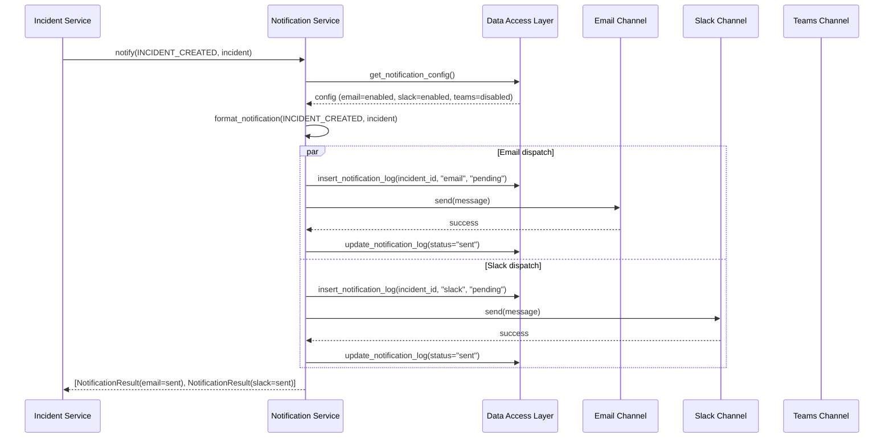
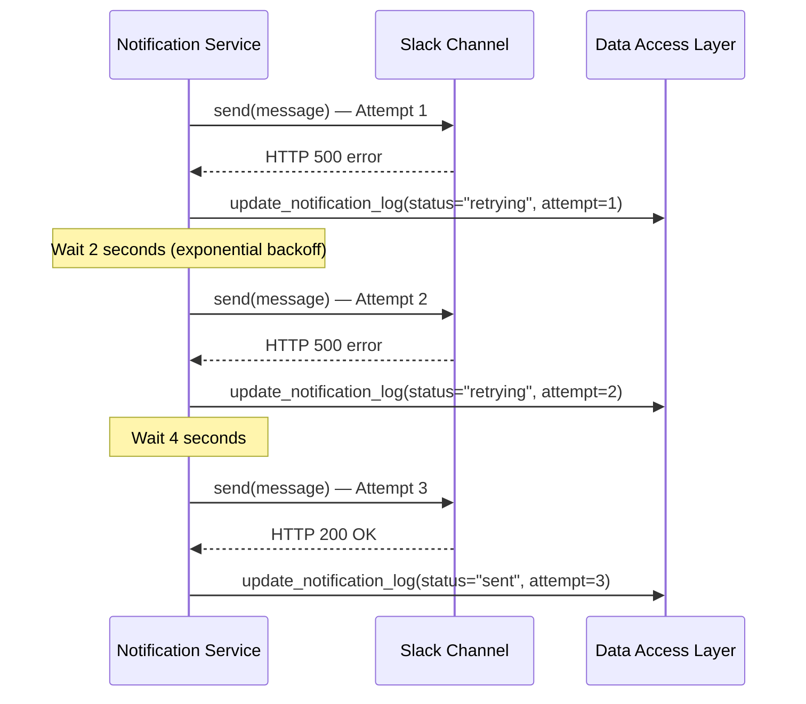

# Low-Level Design (LLD) — Notification Service

| Field                    | Value                                              |
|--------------------------|----------------------------------------------------|
| **Title**                | Notification Service — Low-Level Design            |
| **Component**            | Notification Service                               |
| **Version**              | 1.0                                                |
| **Date**                 | 2026-04-02                                         |
| **Author**               | SDLC Plan & Design Agent                           |
| **HLD Component Ref**    | COMP-003                                           |

---

## 1. Component Purpose & Scope

### 1.1 Purpose

The Notification Service dispatches real-time notifications across email (SMTP), Slack (webhooks), and Microsoft Teams (webhooks) when incident events occur (creation, assignment, status changes). It supports configurable channel enabling/disabling, retry logic with exponential backoff, and logs all notification attempts for audit. This component satisfies BRD-FR-005 through BRD-FR-007, BRD-FR-013, and BRD-NC-001 through BRD-NC-006.

### 1.2 Scope

- **Responsible for**: Dispatching notifications via email, Slack, and Teams; channel configuration management; retry logic; notification logging
- **Not responsible for**: Determining when to send notifications (triggered by Incident Service), user authentication, incident data management
- **Interfaces with**: Incident Service (COMP-002) as event source, Data Access Layer (COMP-006) for channel configuration and notification log persistence

---

## 2. Detailed Design

### 2.1 Module / Class Structure

```
src/
└── notifications/
    ├── __init__.py
    ├── router.py          # FastAPI routes for notification config (admin)
    ├── service.py         # Notification dispatch orchestrator
    ├── models.py          # Pydantic models for notification data
    ├── channels/
    │   ├── __init__.py
    │   ├── base.py        # Abstract base class for notification channels
    │   ├── email.py       # Email (SMTP) channel implementation
    │   ├── slack.py       # Slack webhook channel implementation
    │   └── teams.py       # Teams webhook channel implementation
    ├── templates.py       # Notification message templates
    └── exceptions.py      # Custom notification exceptions
```

### 2.2 Key Classes & Functions

| Class / Function                      | File            | Description                                              | Inputs                               | Outputs                   |
|---------------------------------------|-----------------|----------------------------------------------------------|--------------------------------------|---------------------------|
| `NotificationService`                | service.py      | Orchestrates dispatch across all enabled channels         | —                                    | —                         |
| `NotificationService.notify()`       | service.py      | Dispatches notification for an incident event             | `event_type, incident, recipients`   | `List[NotificationResult]` |
| `NotificationChannel` (ABC)          | channels/base.py| Abstract base class defining channel interface            | —                                    | —                         |
| `NotificationChannel.send()`         | channels/base.py| Abstract method to send a notification                    | `message: NotificationMessage`       | `NotificationResult`      |
| `EmailChannel`                       | channels/email.py| Sends notifications via SMTP                             | SMTP config                          | —                         |
| `SlackChannel`                       | channels/slack.py| Sends notifications via Slack incoming webhook           | Webhook URL                          | —                         |
| `TeamsChannel`                       | channels/teams.py| Sends notifications via Teams incoming webhook           | Webhook URL                          | —                         |
| `get_notification_config()`          | service.py      | Retrieves current channel configuration                  | —                                    | `NotificationConfig`      |
| `update_notification_config()`       | service.py      | Updates channel enable/disable settings                  | `ConfigUpdateRequest`                | `NotificationConfig`      |
| `format_notification()`             | templates.py    | Formats incident data into channel-specific messages     | `event_type, incident`               | `NotificationMessage`     |

### 2.3 Design Patterns Used

- **Strategy Pattern**: Each notification channel implements a common `NotificationChannel` interface. The service iterates enabled channels and dispatches through each.
- **Template Method**: `format_notification()` produces channel-specific message formats (plain text for email, Slack block kit JSON, Teams adaptive card JSON).
- **Retry with Exponential Backoff**: Failed notification attempts are retried up to 3 times with exponential backoff (BRD-NC-006).
- **Dependency Injection**: Channels injected into service at startup based on configuration.

---

## 3. Data Models

### 3.1 Pydantic Models

```python
from pydantic import BaseModel
from typing import Optional, List
from datetime import datetime
from enum import Enum


class NotificationEventType(str, Enum):
    """Types of events that trigger notifications (BRD-NC-004)."""
    INCIDENT_CREATED = "incident_created"
    INCIDENT_ASSIGNED = "incident_assigned"
    INCIDENT_STATUS_CHANGED = "incident_status_changed"


class ChannelType(str, Enum):
    """Supported notification channels."""
    EMAIL = "email"
    SLACK = "slack"
    TEAMS = "teams"


class NotificationStatus(str, Enum):
    """Status of a notification delivery attempt."""
    PENDING = "pending"
    SENT = "sent"
    FAILED = "failed"
    RETRYING = "retrying"


class NotificationMessage(BaseModel):
    """Internal model for a formatted notification."""
    event_type: NotificationEventType
    subject: str
    body_text: str       # Plain text version
    body_html: Optional[str] = None  # HTML version (for email)
    slack_payload: Optional[dict] = None  # Slack block kit payload
    teams_payload: Optional[dict] = None  # Teams adaptive card payload
    incident_id: int
    incident_severity: str
    incident_title: str


class ChannelConfigResponse(BaseModel):
    """Response schema for a single channel's configuration."""
    channel: ChannelType
    enabled: bool
    configured: bool  # Whether required settings (webhook URL, SMTP) are set


class NotificationConfigResponse(BaseModel):
    """Response schema for all notification channel configuration."""
    channels: List[ChannelConfigResponse]


class ChannelConfigUpdateRequest(BaseModel):
    """Request schema for updating a channel's enabled state (BRD-FR-013)."""
    channel: ChannelType
    enabled: bool


class NotificationLogEntry(BaseModel):
    """Log entry for a notification attempt."""
    id: int
    incident_id: int
    channel: ChannelType
    event_type: NotificationEventType
    status: NotificationStatus
    attempt_count: int
    error_message: Optional[str] = None
    created_at: datetime
    last_attempted_at: datetime


class NotificationResult(BaseModel):
    """Result of a single notification dispatch attempt."""
    channel: ChannelType
    status: NotificationStatus
    error_message: Optional[str] = None
```

### 3.2 Database Schema

```sql
CREATE TABLE notification_config (
    id INTEGER PRIMARY KEY AUTOINCREMENT,
    channel TEXT UNIQUE NOT NULL CHECK(channel IN ('email', 'slack', 'teams')),
    enabled BOOLEAN NOT NULL DEFAULT 1,
    updated_at TIMESTAMP DEFAULT CURRENT_TIMESTAMP
);

-- Seed default configuration
INSERT INTO notification_config (channel, enabled) VALUES ('email', 1);
INSERT INTO notification_config (channel, enabled) VALUES ('slack', 1);
INSERT INTO notification_config (channel, enabled) VALUES ('teams', 1);

CREATE TABLE notification_log (
    id INTEGER PRIMARY KEY AUTOINCREMENT,
    incident_id INTEGER NOT NULL REFERENCES incidents(id),
    channel TEXT NOT NULL CHECK(channel IN ('email', 'slack', 'teams')),
    event_type TEXT NOT NULL,
    status TEXT NOT NULL DEFAULT 'pending' CHECK(status IN ('pending', 'sent', 'failed', 'retrying')),
    attempt_count INTEGER NOT NULL DEFAULT 0,
    error_message TEXT,
    created_at TIMESTAMP DEFAULT CURRENT_TIMESTAMP,
    last_attempted_at TIMESTAMP DEFAULT CURRENT_TIMESTAMP
);

CREATE INDEX idx_notif_log_incident ON notification_log(incident_id);
CREATE INDEX idx_notif_log_status ON notification_log(status);
```

---

## 4. API Specifications

### 4.1 Endpoints

| Method | Path                                    | Description                                  | Request Body                    | Response Body                 | Status Codes          | Auth / Role   |
|--------|----------------------------------------|----------------------------------------------|--------------------------------|-------------------------------|-----------------------|---------------|
| GET    | /api/v1/notifications/config           | Get notification channel configuration       | —                              | `NotificationConfigResponse`  | 200, 401, 403         | Admin         |
| PUT    | /api/v1/notifications/config           | Update notification channel settings         | `ChannelConfigUpdateRequest`   | `NotificationConfigResponse`  | 200, 401, 403, 422    | Admin         |
| POST   | /api/v1/notifications/test             | Send a test notification on all channels     | `{channel: ChannelType}`       | `NotificationResult`          | 200, 401, 403, 500    | Admin         |
| GET    | /api/v1/notifications/log              | View notification delivery log               | Query params (filters)         | `List[NotificationLogEntry]`  | 200, 401, 403         | Admin         |

### 4.2 Request / Response Examples

```json
// PUT /api/v1/notifications/config
{
    "channel": "slack",
    "enabled": false
}
```

```json
// 200 OK
{
    "channels": [
        {"channel": "email", "enabled": true, "configured": true},
        {"channel": "slack", "enabled": false, "configured": true},
        {"channel": "teams", "enabled": true, "configured": true}
    ]
}
```

---

## 5. Sequence Diagrams

### 5.1 Notification Dispatch Flow



### 5.2 Retry Flow



---

## 6. Error Handling Strategy

### 6.1 Exception Hierarchy

| Exception Class                     | HTTP Status | Description                                        | Retry? |
|-------------------------------------|-------------|---------------------------------------------------|--------|
| `NotificationChannelError`          | N/A         | Base class for channel-specific errors             | Yes    |
| `EmailDeliveryError`                | N/A         | SMTP connection or delivery failure                | Yes    |
| `SlackWebhookError`                 | N/A         | Slack API returned error or unreachable            | Yes    |
| `TeamsWebhookError`                 | N/A         | Teams API returned error or unreachable            | Yes    |
| `NotificationConfigError`           | 500         | Channel misconfigured (missing webhook URL, etc.)  | No     |
| `AllChannelsFailedError`            | N/A         | All enabled channels failed after retries (logged) | No     |

### 6.2 Error Response Format

Notification errors during incident operations are logged but do not fail the parent operation (BRD-NFR-011). The incident is still created/updated successfully.

For admin config endpoints:
```json
{
    "error": {
        "code": "NOTIFICATION_CONFIG_ERROR",
        "message": "Slack webhook URL is not configured",
        "details": {"channel": "slack"}
    }
}
```

### 6.3 Logging

- **INFO**: Notification sent successfully (channel, incident_id, event_type, latency)
- **WARNING**: Notification delivery failed, retrying (channel, attempt, error)
- **ERROR**: All retry attempts exhausted (channel, incident_id, final error)
- **Context**: Incident ID, channel type, event type, attempt count, latency

---

## 7. Configuration & Environment Variables

| Variable                 | Description                                    | Required | Default              |
|--------------------------|------------------------------------------------|----------|----------------------|
| `SMTP_HOST`              | SMTP server hostname                           | No*      | —                    |
| `SMTP_PORT`              | SMTP server port                               | No       | 587                  |
| `SMTP_USER`              | SMTP authentication username                   | No*      | —                    |
| `SMTP_PASSWORD`          | SMTP authentication password                   | No*      | —                    |
| `SMTP_SENDER`            | Email sender address                           | No*      | —                    |
| `SMTP_USE_TLS`           | Whether to use TLS for SMTP                    | No       | true                 |
| `NOTIFICATION_RECIPIENTS`| Comma-separated email recipients for alerts    | No*      | —                    |
| `SLACK_WEBHOOK_URL`      | Slack incoming webhook URL                     | No*      | —                    |
| `TEAMS_WEBHOOK_URL`      | Teams incoming webhook URL                     | No*      | —                    |
| `NOTIFICATION_RETRY_MAX` | Maximum retry attempts per notification        | No       | 3                    |
| `NOTIFICATION_RETRY_BASE`| Base delay (seconds) for exponential backoff   | No       | 2                    |

*Required if respective channel is enabled.

---

## 8. Dependencies

### 8.1 Internal Dependencies

| Component              | Purpose                                       | Interface                                     |
|------------------------|-----------------------------------------------|-----------------------------------------------|
| COMP-002 (Incident)    | Event source triggering notifications         | `notify(event_type, incident_data)`           |
| COMP-006 (Data Access) | Persist notification config and delivery logs  | `get_notification_config()`, `insert_notification_log()` |

### 8.2 External Dependencies

| Package / Service       | Version     | Purpose                                  |
|-------------------------|-------------|------------------------------------------|
| httpx                   | 0.27+       | Async HTTP client for Slack/Teams webhooks |
| aiosmtplib              | 3.x         | Async SMTP client for email notifications |

---

## 9. Traceability

| LLD Element                            | HLD Component  | BRD Requirement(s)                      |
|----------------------------------------|----------------|-----------------------------------------|
| EmailChannel.send()                    | COMP-003       | BRD-FR-005, BRD-NC-001                 |
| SlackChannel.send()                    | COMP-003       | BRD-FR-006, BRD-NC-002                 |
| TeamsChannel.send()                    | COMP-003       | BRD-FR-007, BRD-NC-003                 |
| NotificationService.notify()           | COMP-003       | BRD-NC-004                              |
| PUT /api/v1/notifications/config       | COMP-003       | BRD-FR-013, BRD-NC-005                 |
| Retry with exponential backoff         | COMP-003       | BRD-NC-006                              |
| notification_log table                 | COMP-003       | BRD-NFR-012                             |
| Non-blocking notification failures     | COMP-003       | BRD-NFR-011                             |
